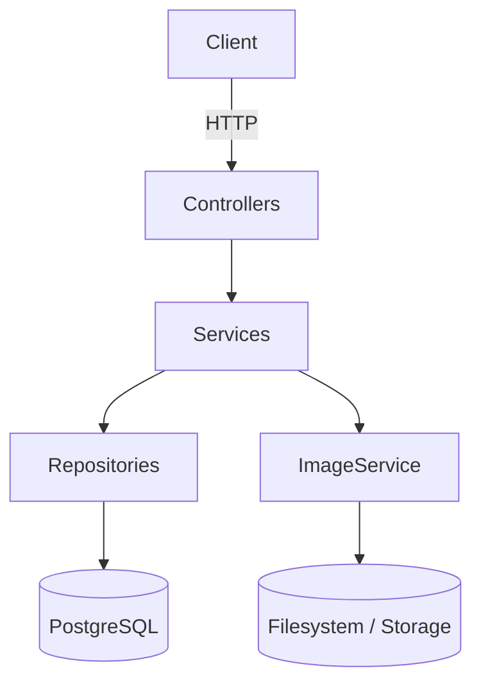
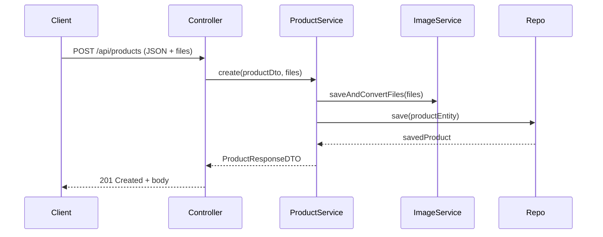

# GestFood

[](https://github.com/jpincode/gestfood/actions)  
[](https://github.com/jpincode/gestfood/releases)  
[](LICENSE)  
[](https://github.com/jpincode/gestfood)  

GestFood is a Spring Boot application that provides a simple, RESTful backend for restaurant management: desks (tables), products (with images and WebP conversion), employees, orders, and a basic reporting model. It follows a Controller → Service → Repository architecture with DTOs and JPA entities.

Author: João Araújo — joaoaraujo.developer@gmail.com — https://github.com/jpincode

---

## Table of Contents

- [Badges](#badges)
- [Project Title and Description](#project-title-and-description)
- [Prerequisites & Dependencies](#prerequisites--dependencies)
- [Installation](#installation)
- [Configuration](#configuration)
- [Usage & Examples](#usage--examples)
- [Project Structure](#project-structure)
- [Architecture](#architecture)
- [API Reference](#api-reference)
- [Endpoints](#endpoints)
- [Testing](#testing)
- [Deployment](#deployment)
- [Roadmap](#roadmap)
- [Contributing](#contributing)
- [Technologies Used](#technologies-used)
- [Author & Credits](#author--credits)
- [License](#license)

---

## Badges

- Build:   
- Version:   
- License:   
- Code Coverage: 

(Replace with your CI and coverage links when available.)

---

## Project Title and Description

GestFood — a lightweight, modular REST API to manage restaurant operations:

- CRUD operations for desks, products (with image handling), employees, and orders.
- Image upload and conversion to WebP using an image service (ImageSevice).
- DTO-based requests/responses and global exception handling.
- Simple reporting model (entity `Report` added).

The application uses Spring Boot, Spring Data JPA, and PostgreSQL.

---

## Prerequisites & Dependencies

Software required:

- Java JDK 25 or later
- Maven (wrapper included)
  - On Windows: use `mvnw.cmd`
  - On macOS/Linux: use `./mvnw`
- PostgreSQL 18.1 (or compatible)
- Optional: Docker / Docker Compose

Main dependencies (from pom.xml):

- Spring Boot (Web, Data JPA, Validation)
- PostgreSQL JDBC driver
- Lombok
- c-webp (image conversion)
- JUnit (for testing)

---

## Installation

Clone the repo and build:

```bash
# Clone
git clone https://github.com/jpincode/gestfood.git
cd gestfood

# Build (Unix/macOS)
./mvnw clean install

# Windows (PowerShell / CMD)
.\mvnw.cmd clean install
```

Start the app:

```bash
# Unix/macOS
./mvnw spring-boot:run

# Windows
.\mvnw.cmd spring-boot:run
```

Or build artifact and run the jar:

```bash
./mvnw clean package -DskipTests
java -jar target/gestfood-0.0.1-SNAPSHOT.jar
```

---

## Configuration

Configuration files and environment:

- Default properties: `src/main/resources/application.properties`.
- Optional: Use environment variables (or a `.env` file in your workflow) to override properties.

Common environment variables (examples):

```env
DB_URL=jdbc:postgresql://localhost:5432/gestfood
DB_USERNAME=postgres
DB_PASSWORD=secret
SPRING_PROFILES_ACTIVE=dev
APP_UPLOAD_DIR=uploads/images
SERVER_PORT=8080
```

application.properties (example snippets you can use or modify):

```
spring.datasource.url=${DB_URL:jdbc:postgresql://localhost:5432/gestfood}
spring.datasource.username=${DB_USERNAME:postgres}
spring.datasource.password=${DB_PASSWORD:secret}
spring.jpa.hibernate.ddl-auto=update
spring.jpa.show-sql=true
server.port=${SERVER_PORT:8080}
app.upload.dir=${APP_UPLOAD_DIR:uploads/images}
```

- Profiles: `dev`, `test`, `prod`. Use `SPRING_PROFILES_ACTIVE` to switch.
- Ensure `APP_UPLOAD_DIR` is writable by the application.

---

## Usage & Examples

Run the application and use the API:

Base URL (default): http://localhost:8080

- List products:
```bash
curl -s http://localhost:8080/api/products
```

- Get product by id:
```bash
curl -s http://localhost:8080/api/products/1
```

- Create product (multipart: JSON + image):
```bash
curl -X POST "http://localhost:8080/api/products" \
  -H "Content-Type: multipart/form-data" \
  -F 'product={"name":"Margherita","price":12.5,"description":"Classic pizza"};type=application/json' \
  -F "files=@/path/to/image.jpg" 
```

- Create desk:
```bash
curl -X POST http://localhost:8080/api/desks \
  -H "Content-Type: application/json" \
  -d '{"seats":4}'
```

- Create employee:
```bash
curl -X POST http://localhost:8080/api/employees \
  -H "Content-Type: application/json" \
  -d '{"name":"John Doe","email":"john@example.com","cpf":"12345678900","password":"secret","role":"ADMIN"}'
```

- Create order:
```bash
curl -X POST http://localhost:8080/api/orders \
  -H "Content-Type: application/json" \
  -d '{
    "description":"Order #1",
    "status":"NEW",
    "client":{"id":1},
    "products":[{"id":1},{"id":2}]
  }'
```

Example successful response for GET /api/products:

```json
[
  {
    "id": 1,
    "name": "Margherita",
    "description": "Classic pizza",
    "price": 12.5,
    "images": [
      {"id": 1, "url": "/uploads/images/abc.webp"}
    ],
    "createdAt": "2025-10-01T12:00:00Z"
  }
]
```

Notes:
- Many endpoints accept/return DTOs (ProductRequestDTO, ProductResponseDTO, etc.)
- Multipart upload for product includes a key `product` containing JSON and `files` containing images.

---

## Project Structure

High-level tree (source: `src/main/java/com/gestfood/gestfood`):

- GestfoodApplication.java — Spring Boot application bootstrap
- business/
  - dto/ — Request/Response DTO classes for client, product, desk, order, employee
  - exception/ — Custom exceptions and ErrorResponse DTOs
  - service/ — Application business services (DeskService, ProductService, ImageSevice, EmployeeService, OrderService, ValidationService)
- model/
  - entity/ — JPA Entities: AbstractUser, Client, Employee, Desk, Product, ProductImage, Order, Report
  - enums/ — Enums: ImageType, ReportStatus, ReportType
  - repository/ — Spring Data JPA Repositories
- presentation/controller/ — REST controllers: DeskController, ProductController, EmployeeController, OrderController
- config/
  - GlobalExceptionHandler — centralized error handling

`src/main/resources`:
- application.properties
- static/ and templates/ — placeholders for the web UI if added (Thymeleaf)

Files to look at when you need to change behavior:
- `ImageSevice.java` — image conversion & storage handling (includes WebP conversion)
- `ValidationService.java` — input validations
- DTOs and request validation annotations — to control incoming request payload shape

---

## Architecture

Design: Standard multilayer application

- Controllers (presentation) → Services (business) → Repositories (persistence → PostgreSQL)
- DTOs convert between payloads and entities; service layer holds validation and business rules.
- ImageService converts uploaded images to WebP and saves metadata.

Mermaid diagrams:

Component Diagram:


Sequence: Create Product (multipart):


---

## API Reference

The API is RESTful and centered under `/api`. Controllers and DTOs determine structure. All endpoints below typically return JSON and use HTTP status codes:

- 200 OK — Resource retrieved
- 201 Created — Resource created
- 204 No Content — Resource deleted / no body
- 400 Bad Request — Validation failure (BadRequestException)
- 404 Not Found — Resource not found (EntityNotFoundException)
- 409 Conflict — Conflict (EntityConflictException)
- 500 Internal Server Error — Unexpected error

Common DTO fields (examples):

- ProductRequestDTO:
  - name (String)
  - description (String)
  - price (number)
  - (additional optional fields in DTO)
- ProductResponseDTO:
  - id, name, description, price, images (list of image objects)
- EmployeeRequestDTO:
  - name, email, cpf, password, role
- DeskRequestDTO:
  - seats
- OrderRequestDTO:
  - description, status, client (object with id), products (array of objects with id)
- ClientRequestDTO:
  - name, phone, email (optional as required by DTOs)

ValidationService centrally validates IDs and basic invariants. Exceptions are wrapped into ErrorResponse objects in `GlobalExceptionHandler`.

---

## Endpoints

Desks (/api/desks)
- GET /api/desks
  - returns: List<DeskResponseDTO>
- GET /api/desks/{id}
  - returns: DeskResponseDTO
- POST /api/desks
  - request: { "seats": 4 }
  - response: 201 Created + DeskResponseDTO
- PUT /api/desks/{id}
  - request: { "seats": 6 }
- DELETE /api/desks/{id}
  - response: 204 No Content

Products (/api/products)
- GET /api/products
  - returns: List<ProductResponseDTO>
- GET /api/products/{id}
- POST /api/products
  - Content-Type: multipart/form-data
  - parts:
    - product: JSON matching ProductRequestDTO
    - files: multipart file(s)
  - response: 201 Created + ProductResponseDTO
- PUT /api/products/{id}
  - Content-Type: multipart/form-data
  - replace fields / update images
- DELETE /api/products/{id}

Employees (/api/employees)
- GET /api/employees
- GET /api/employees/{id}
- POST /api/employees
  - request: EmployeeRequestDTO
- PUT /api/employees/{id}
- DELETE /api/employees/{id}
- Note: Endpoints potentially restricted to ADMIN (not yet enforced globally — plan in Roadmap)

Orders (/api/orders)
- GET /api/orders
- GET /api/orders/{id}
- POST /api/orders
  - request: OrderRequestDTO with client id and product ids
  - Response: OrderResponseDTO with computed `totalAmount`
- PUT /api/orders/{id}
- DELETE /api/orders/{id}

Errors — Example ErrorResponse:
```json
{
  "status": 400,
  "message": "Request invalid",
  "errors": [
    "Field 'name' is required"
  ],
  "timestamp": "2025-10-01T12:00:00Z"
}
```

---

## Testing

Run unit tests:

```bash
# Unix/macOS
./mvnw test

# Windows
.\mvnw.cmd test
```

Tests are in `src/test/java`. Add more unit tests under `business/service` and controllers for increased coverage. Consider adding integration tests for database-backed tests and MockMvc tests for controllers. Add JaCoCo to POM for coverage reports.

---

## Deployment

Local:
- Set environment variables and run with `spring-boot:run` or run the packaged JAR.

Production recommendations:
- Run behind a reverse proxy (Nginx) or in a container orchestrator (Kubernetes).
- Use secure database credentials and ensure SSL on Postgres if remote or in cloud.
- Consider external storage (S3) for product images and move image conversion to a background worker for scalability.

Docker example:

Dockerfile
```dockerfile
FROM eclipse-temurin:25-jre
ARG JAR_FILE=target/gestfood-0.0.1-SNAPSHOT.jar
COPY ${JAR_FILE} app.jar
ENV SPRING_PROFILES_ACTIVE=prod
ENTRYPOINT ["java","-jar","/app.jar"]
```

docker-compose.yml (example):
```yaml
version: "3.8"
services:
  db:
    image: postgres:15
    environment:
      POSTGRES_DB: gestfood
      POSTGRES_USER: postgres
      POSTGRES_PASSWORD: secret
    ports:
      - "5432:5432"
    volumes:
      - pgdata:/var/lib/postgresql/data

  app:
    build: .
    ports:
      - "8080:8080"
    environment:
      DB_URL: jdbc:postgresql://db:5432/gestfood
      DB_USERNAME: postgres
      DB_PASSWORD: secret

volumes:
  pgdata:
```

---

## Roadmap

Short- and mid-term improvements:

- Add authentication and authorization (JWT or OAuth2) with RBAC and admin-limited endpoints.
- Add full test coverage and CI integration with JaCoCo.
- Implement pagination/filtering on listing endpoints.
- Implement explicit roles & permissions for employees and endpoints.
- Add a UI (Thymeleaf or SPA) for basic dashboard (board management, product catalog, orders).
- Move images to cloud storage (e.g., S3) and async WebP conversion for performance.
- Add reporting functionality and scheduled tasks for generating reports (entity `Report` exists).

---

## Contributing

- Fork the repository and create feature branches.
- Follow current patterns: Controller → Service → Repository, use DTOs for API payloads.
- Validate input with Bean Validation: `@Valid`, `@NotNull`, etc.
- Add unit/integration tests for new features.
- Submit PRs with clear descriptions and issue references.
- Follow project's code conventions and architecture.

Code of Conduct:
- Be respectful and follow open-source norms.
- Keep contributions focused and small, with tests demonstrating expected behavior.

---

## Technologies Used

- Java 25 (OpenJDK / Eclipse Temurin)
- Spring Boot 3.5.8
- Spring Web, Spring Data JPA
- PostgreSQL (driver compatible)
- Lombok
- c-webp / WebP conversion library
- Maven

---

## Author & Credits

- João Araújo — joaoaraujo.developer@gmail.com  
- GitHub: https://github.com/jpincode

Acknowledgments:
- Uses Spring Boot and many open-source libraries; see `pom.xml` for full dependency list.

---

## License

Check the project's `LICENSE` file. If the `LICENSE` file is missing or indicates a custom license, follow that license for usage and redistributions.

---

If you want, I can:
- Add a `docker-compose.yml`, `Dockerfile`, and environment templates into the repo,
- Add JaCoCo to the POM and a GitHub Actions workflow for build and test,
- Generate Postman collection or OpenAPI/Swagger definitions for all endpoints,
- Add integration tests and a CI pipeline example.